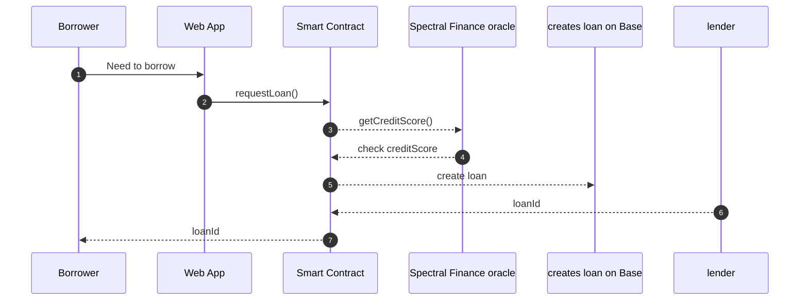
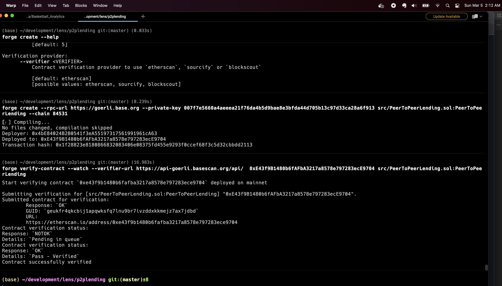
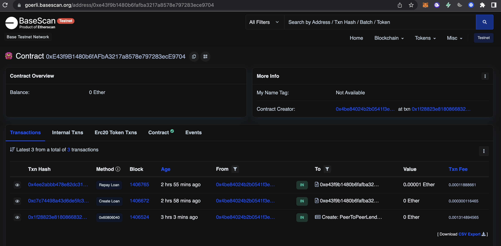

# peer-to-peer-lending protocol

Allow users to lend assets based on the credit score retrieved from Spectral Finance. There will be an interest and lending period, users can repay the loan at any time. Deployed on Base, using Spectral finance oracle

## Design

1. Borrower requests a loan from the Lender
2. The smart contract calls the Spectral Finance oracle to get the credit score of the borrower
3. The smart contract checks if the credit score is above the minimum required
4. Lender creates a loan and transfers the funds to the smart contract
5. The smart contract transfers the funds to the borrower
6. The borrower can repay the loan at any time

`Contract: 0xe43f9b1480b6fafba3217a8578e797283ece9704`

### This is what we aspired to do

# add image

Peer to Peer Lending Contract v0.1 deployed on Base

## How to run

foundry tools

## Contract and Transaction on Base

Add contract screenshot

Add transaction screenshot